# Artigo Tutorial

## Introdução
Este tutorial irá guiá-lo(a) no desenvolvimento de um circuito utilizando componentes eletrônicos básicos e programação no Arduino Uno. O objetivo é montar, programar e testar um artefato funcional com diversas interações.

---

## Lista de Componentes
Para montar este circuito, você precisará dos seguintes itens:

- **1x Arduino Uno**  
  Placa microcontroladora para gerenciar o circuito.  
- **1x Botão**  
  Para controle de interação.  
- **1x Servo Motor**  
  Para criar movimentos rotacionais precisos.  
- **1x LED**  
  Indicador luminoso.  
- **1x Resistor de 220Ω**  
  Protege o LED contra corrente excessiva.  
- **1x Tela LCD**  
  Para exibir informações.  
- **12x Jumpers**  
  Para conectar os componentes na protoboard ou diretamente ao Arduino.  

---

## Configurando o Sistema

## Passo 1: Inicializando o Display LCD
### Objetivo
Configurar o LCD para exibir as mensagens "Aperte para tirar uma foto!","Tempo Restante:", "Tirando foto...", "Obrigado =)".

### Conexão Física
Conecte o LCD aos pinos do Arduino conforme o protocolo I2C:  
- **VCC e GND:** Conecte aos pinos de alimentação 5V e GND.  
- **SDA:** Conecte ao pino analógico A4 no Arduino Uno.  
- **SCL:** Conecte ao pino analógico A5 no Arduino Uno.

Abaixo está uma imagem que ilustra as conexões físicas entre o Arduino e o LCD:

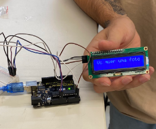

### Explicação do Código
1. **Inicialização do LCD:**
   - A biblioteca `LiquidCrystal_I2C` é utilizada para controlar o display com comunicação I2C.
   - O endereço **`0x27`** é o padrão do módulo I2C conectado ao LCD.  

2. **Função `padrao()`:**
   - Esta função limpa o LCD, posiciona o cursor e exibe a mensagem padrão.

#### Trecho de Código

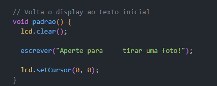

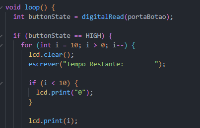

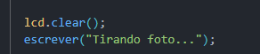

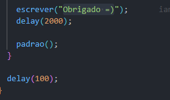

## Passo 2: Configurando o Botão

### Objetivo
Adicionar um botão ao circuito que, ao ser pressionado, inicia a contagem regressiva e outras interações.

### Conexão Física
Conecte o botão ao Arduino seguindo estas instruções:
- **Um terminal do botão:** Conecte ao pino digital 7 do Arduino (definido como `portaBotao` no código).
- **Outro terminal do botão:** Conecte ao GND.
- Caso necessário, utilize um resistor pull-down para garantir que o estado inicial do botão seja LOW.

Abaixo está a imagem do botão utilizado no projeto:

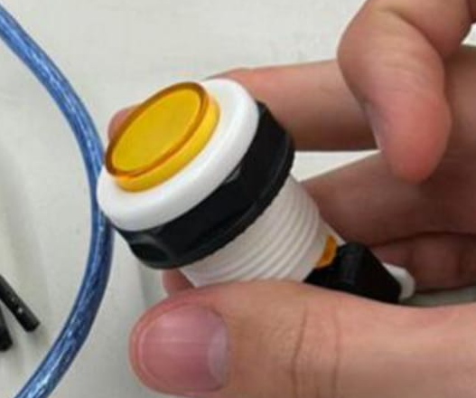

---

### Explicação do Código
O botão é lido no programa utilizando a função `digitalRead`. O código abaixo verifica se o botão foi pressionado e, em caso positivo, executa a sequência programada.

#### Trecho de Código

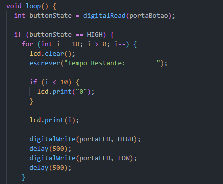

## Passo 3: Configurando o LED

### Objetivo
Adicionar um LED ao circuito para criar efeitos visuais, como piscar durante a contagem regressiva e no momento da simulação de captura da foto.

### Conexão Física
1. Conecte o ânodo (perna longa) do LED ao pino digital 2 do Arduino (definido como `portaLED` no código).
2. Conecte o cátodo (perna curta) do LED a um resistor de 220Ω.
3. Conecte a outra extremidade do resistor ao GND.

Abaixo está a imagem mostrando o LED conectado à protoboard:

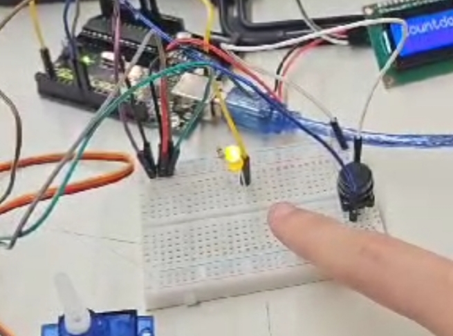

---

### Explicação do Código
O LED é controlado utilizando a função `digitalWrite` para acendê-lo (`HIGH`) ou apagá-lo (`LOW`). Abaixo está o trecho de código responsável pela configuração e controle do LED.

#### Trecho de Código

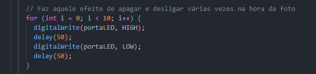

## Passo 4: Configurando o Servo Motor

### Objetivo
Adicionar um servo motor ao circuito para simular um movimento de "disparo", criando uma interação física durante o processo.

### Conexão Física
1. Conecte o fio **laranja (sinal)** do servo motor ao pino digital 8 do Arduino (definido como `portaServo` no código).
2. Conecte o fio **vermelho (VCC)** ao pino de alimentação 5V do Arduino.
3. Conecte o fio **marrom (GND)** ao pino GND do Arduino.

Abaixo está a imagem do servo motor conectado:

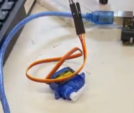

---

### Explicação do Código
O servo motor é controlado utilizando a biblioteca `Servo.h`, que permite especificar o ângulo de rotação em graus.

#### Trecho de Código

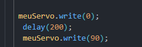